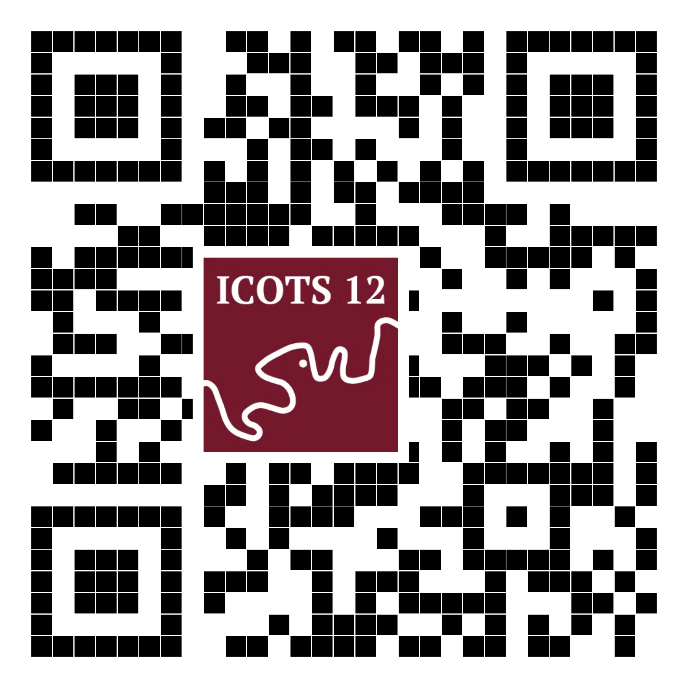
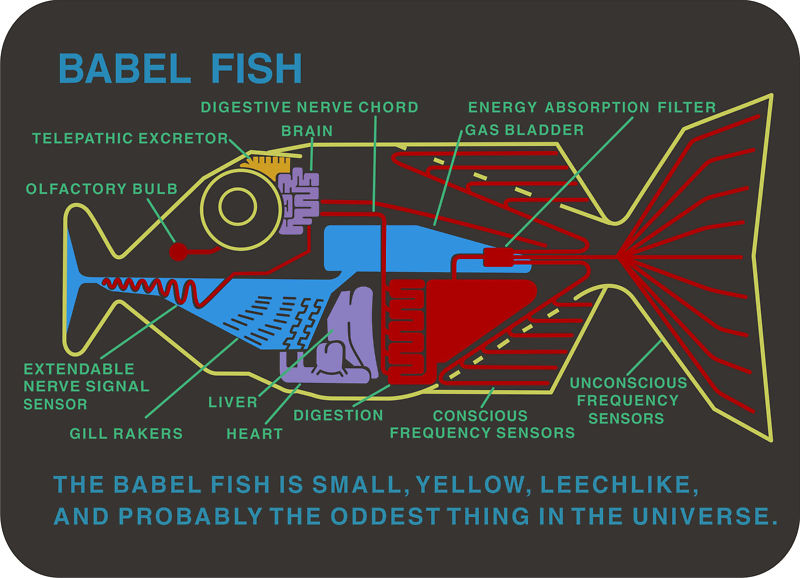
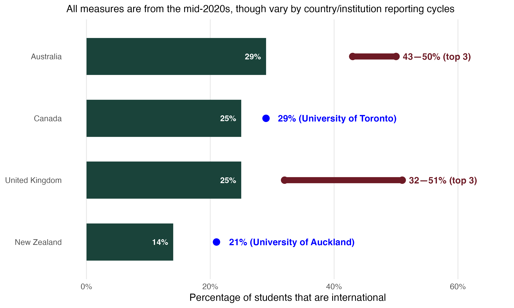
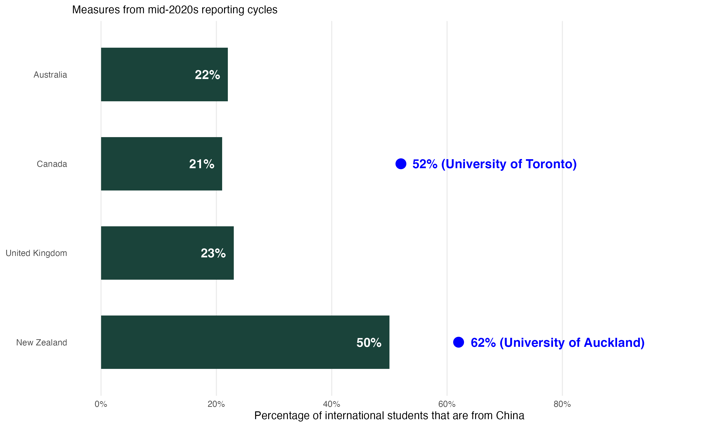

## Warm Pacific greetings

:::: {.columns}

::: {.column .left-column-container width="60%"}
Talofa lavaSamoan, 
Malo e leleiTongan, 
Kia oranaCook Islands Māori, 
Mālo niTokelauan, 
Fakaalofa lahi atuNiuean, 
Ni sa bulaFijian, 
FakatalofaTuvaluan, 
Kia orate reo Māori. 

{fig-align="center" width="55%"  alt="QR code with ICOTS logo embedded"}

::: {.gallery-plaque}
::: {.artist}
Unknown
:::

::: {.artwork-title}
Greetings from New Zealand
:::

::: {.meta}
1900-1910 (with later colouring likely added). Gift of Patricia M. Mitchell, 1989. Te Papa (PS.000812)
:::
:::
:::

::: {.column .column-image-bg role="img" height="60%" alt='A vintage sepia-toned postcard collage titled "Greetings from New Zealand." The central image features a stylized outline map of New Zealand with the text "Greetings from New Zealand" embossed diagonally across it. The collage includes multiple photographic portraits of Māori women in traditional attire, hand-colored floral accents featuring pink roses, white daisies, and purple orchids, an early New Zealand flag variation with a Union Jack base, and a shield emblem labeled "The Southern Cross."' style="background-image: url('img/MA_I406706_TePapa_Greetings-from-New-Zealand_full.jpg');"}

:::

::::

---

## Acknowledgement of country 

:::: {.columns}

::: {.column .left-column-container width="60%"}

We acknowledge the **Jagera** and **Turrbal** peoples as the Traditional Custodians of **Meanjin** (Brisbane), the lands and waterways where we gather, learn, and share knowledge during ICOTS 12.

We pay our respects to their Elders past, present, and emerging, recognizing their enduring and continuous connection to land, water, and community.

::: {.gallery-plaque}
::: {.artist}
**Mike Tippo**  
*Australia, QLD, b.1954*
:::

::: {.artwork-title}
*The making of Queensland Aboriginal law* (1989)
:::

::: {.meta}
Synthetic polymer paint on canvas  
Queensland Art Gallery | Gallery of Modern Art © Mike Tippo [(Collection link)](https://collection.qagoma.qld.gov.au/objects/1608)
:::
:::

:::

::: {.column .column-image-bg role="img" alt='The artwork is made with synthetic polymer paint that creates a dense, detailed composition rooted in Indigenous Australian visual storytelling. It combines traditional dotting techniques, repeating geometric patterns, and stylized symbolic figures or tracks that map out concepts of law, culture, and country in rich earth tones contrasted with striking lines.' style="background-image: url('img/tippo.jpg'); width: 40%;"}
:::

::::

---

## Tangata whenua

:::: {.columns}

::: {.column .left-column-container width="60%"}

The teaching and research that informs this presentation were conducted on the traditional lands of **Māori** under te Tiriti o Waitangi and of the **Anishinaabe**, the **Haudenosaunee** and the **Mississaugas of the Credit** under the Dish With One Spoon Treaty and, more recently, Treaty 13 between the **Mississaugas** and the British Crown. 

Additional experiences at Southwest University, China, also informed this work.

::: {.gallery-plaque}
::: {.artist}
**Emily Kewageshig**  

:::

::: {.artwork-title}
*The Stillness of Winter* (2025)
:::

::: {.meta}
Fine art print | [www.emily-kewageshig.com](https://www.emily-kewageshig.com/)  
:::
:::

:::

::: {.column .column-image-bg role="img" alt='A painting featuring stylized animals of the land, air, and water. A deer stands in front of a glowing sun on a hill, flanked by a flying eagle on the left and a snow-dusted pine tree on the right. Below them, a green sea turtle and a brown fish swim in flowing blue water against a bright blue background.' style="background-image: url('img/kewageshig.jpg'); width: 40%;"}
:::

::::

---

## Positionality statement

:::: {.columns}

::: {.column .left-column-container width="60%"}

:::{.fragment}
English is the first language I learned.
:::

:::{.fragment} 
I have never had my personal success, safety, or access to resources rely on my abilities in another language. 
:::

:::{.fragment}
Language is not *just* a skill — it is part of **culture**, **identity**, and how we know others and make ourselves known in turn.
:::

::: {.notes}
English is the first language I learned, *and it is the only language I am fluent in.*
I have never had my personal success, safety, or access to resources rely on my abilities in another language. 
*This is despite being born in a country where I don't speak any of the indigenous languages, moving as a young person to another country where I didn't speak the indigenous language, and being here with your today in another country where I don't speak the Indigenous language. I'd also like to acknowledge that* many people in this room will have first-hand experience with learning English as an additional language that I don’t.
:::

::: {.gallery-plaque}
::: {.artist}
**Leonardo da Vinci**  
*Italy, b.1452–d.1519*
:::

::: {.artwork-title}
Portrait of an unknown woman (c. 1490–96)
:::

::: {.meta}
Oil on wood panel | Musée du Louvre, Paris
:::
:::

:::

::: {.column .column-image-bg role="img" alt='A close-up oil portrait of a young woman. The subject is turned slightly to the right but directs a calm, steady gaze out toward the viewer. She has fair skin, high cheekbones, dark oval eyes, and straight dark hair slicked back over her ears, with a thin black cord across her brow holding a small red gemstone. Her ornate dress is deep red with gold and brown trim, detailed with puffed white undersleeves tied with gold ribbons. She is positioned behind a simple grey stone ledge, and the entire background is flat, solid black.' style="background-image: url('img/davinci.jpg'); width: 40%;"}
:::

::::

---

## Will this be useful to you?

:::: {.columns}

::: {.column .left-column-container width="60%"}

Not a lot of ELLs? Should you sneak out now?

:::{.fragment}
- Connects to: **Universal Design for Learning** & **trauma-informed pedagogy**.
-  May pull financial levers in your institution that other lenses do not.
:::

:::{.fragment}
::: {.ribbon-vintage}
{alt="Decorative GIF of a fedora icon tipping backwards and forwards."}

::: {.ribbon-text-block}
- [Nicky Wakim on trauma-informed pedagogy](https://virtual.oxfordabstracts.com/event/73693/submission/191)  
- [Paul Fijn on designing for accessibility](https://virtual.oxfordabstracts.com/event/73693/submission/267)
:::
:::
:::

::: {.gallery-plaque}
::: {.artist}
**Pere Borrell del Caso**  
*Spain, b.1835–d.1910*
:::

::: {.artwork-title}
Escaping Criticism (*Huyendo de la crítica*) (1874)
:::

::: {.meta}
Oil on canvas | Collection of the Banco de España, Madrid
:::
:::

:::

::: {.column .column-image-bg role="img" alt="A trompe-l'oeil painting of a wide-eyed, barefoot boy climbing forward out of a dark picture frame, gripping the edges as if stepping into the real world." style="background-image: url('img/del_caso.png'); width: 40%;"}
:::

::::

---

## Will this be useful to any of us?

:::: {.columns}

::: {.column .left-column-container width="60%"}

* The **elephant** in the room?  AI babel fish for all?
  
    
  

:::{.fragment}
* **The importance of process:** While AI and technological enhancements will change *how* we approach products, the human process will continue to matter.
:::

:::{.fragment}
::: {.ribbon-vintage}
{alt="Decorative GIF of a fedora icon tipping backwards and forwards."}

::: {.ribbon-text-block}
- [Nick Bussberg on sustainability examples](https://virtual.oxfordabstracts.com/event/73693/submission/55)

- [Claire, Tyler, & Emily on community-engaged courses ](https://virtual.oxfordabstracts.com/event/73693/submission/42)  
:::
:::
:::

:::{.notes}
Writing, coding, and speaking are not just to produce outputs.

So many of the panels and talks this week have reinforced the value of what we do. In Mine's response in the What's my fitted model panel, she made a really great point about the challenges of translation without the ability to check the quality of these translations. This was with respect to code, but the language example holds true.
:::

::: {.gallery-plaque}
::: {.artist}
**Max Ernst**  
*Germany, b.1891–d.1976*
:::

::: {.artwork-title}
The Elephant Celebes (*Celebes*) (1921)
:::

::: {.meta}
Oil on canvas | Tate Modern, London
:::
:::

:::

::: {.column .column-image-bg role="img" alt="A surrealist painting dominated by a large, round, dark green boiler-like structure resembling a mechanical elephant with short legs and a hose-like trunk. In the foreground stands a headless female nude torso with a raised right arm, set against a muted blue-gray sky." style="background-image: url('img/ernst.jpg'); width: 40%;"}
:::

::::

---

## Around the world in 80 years

:::: {.columns}

::: {.column .left-column-container width="60%"}

- Rapid **globalisation** and student mobility over the last 80 years, particularly Asia → Western Anglophone nations. [@altbach2009trends; @marginson2016high]
- English as the **lingua franca** of academia. [@wilkins2014english] 
- Higher ed **marketised**, international students a critical source of revenue for institutions [@knight2004internationalization; @oecd2025key]. 

:::{.notes}
Over the last 80 years, tertiary education has been defined by rapid globalisation and student mobility, particularly from Asia to Western Anglophone nations with post-graduation work opportunities (Altbach et al., 2009; Marginson, 2016). This has fostered the rise of English as the lingua franca of academia (Wilkins and Urbanovič, 2014). At the same time, higher education has become increasingly marketised, with international students viewed as a critical source of revenue for institutions (Knight, 2004; OECD, 2025). 
:::

::: {.gallery-plaque}
::: {.artist}
**Marguerite Gérard**  
*France, b.1761–d.1837*
:::

::: {.artwork-title}
Young Woman Consulting a Globe (*Jeune femme consultant un globe*) (c. 1790)
:::

::: {.meta}
Oil on panel | Private Collection
:::
:::

:::

::: {.column .column-image-bg role="img" alt='An 18th-century oil painting shows a young woman with her back mostly turned, wearing an elegant light ivory silk gown, leaning over a wooden desk to examine a large geographic globe. There is a small black-and-white dog at her feet.' style="background-image: url('img/gerard.jpg'); width: 40%;"}
:::

::::

---

## International student enrollments in universities 

::::{.columns}

:::{.column width="91%"}

:::

::: {.column width="9%" .small-text}

@australianeducation2024,  
@australianeducation2025,  
@hesa2024,  
@nz_education_counts_2026_enrolment_data,   @statcan_postsecondary_2026,  
@qs2023,   
@australianeducation2024,   
@uoa2024annual,   
@uoftfacts
:::

::::

---

## International ≠ ELL

**English Language Learners (ELL)**: students who speak another language more fluently than they speak English AND need support to engage confidently in the standard English dialect of their educational environment.

:::{.fragment}
> A note on terms: ELL is used by the Ministry of Education in Aotearoa New Zealand [@franken2023new, @moe2024]. Other educational organisations advocate for **"multilingual learners"** [@ergo2022]. In Australia the term **"EAL/D"** includes Aboriginal and Torres Strait Islander students who may speak Aboriginal English and Kriol [@nesa_eald_support_2026].
:::

:::: {.columns}

::: {.column .left-column-container width="60%"}

:::{.fragment}
::: {.ribbon-vintage}
{alt="Decorative GIF of a fedora icon tipping backwards and forwards."}

::: {.ribbon-text-block}
- [Michael Moon on teaching ethics at UofT — 84% of students did not consider English to be their 'first' language](https://virtual.oxfordabstracts.com/event/73693/submission/192)

:::
:::
:::

:::

::: {.column width="40%"}
:::

::::

---

## International students from China

::::{.columns}

:::{.column width="91%"}

:::

::: {.column width="9%" .small-text}
Note: EU students not counted as international for UK calculation

@australianeducation2024,  
@educationcounts2024,  
@hesa2024,  
@statcan_postsecondary_2026,  
@uoa2024annual,  
@uoftfacts
:::

::::

:::{.notes}
This specific student pipeline brings distinct educational and cultural backgrounds that heavily influence classroom dynamics in Anglosphere universities. Historically, English education in China has been driven by high-stakes testing mechanisms such as the Gaokao and the College English Test (CET). This exam-oriented system creates a focus on rote memorisation, grammatical accuracy, and reading comprehension over communicative fluency (Cheng and Hamid, 2025; Han, 2021; Snow et al., 2017). As a result, many Chinese students arrive at Anglosphere universities having passed qualifying examinations of their technical language abilities, yet struggle with the demands of academic participation. Compounding this challenge, recent data indicates an overall decline in China’s general English proficiency ratings (Education First, 2025), potentially due to pandemic-related learning disruptions (Zou, 2023), strict domestic restrictions on private tutoring (Yao, 2023), and shifting cultural perceptions regarding the necessity of English language acquisition (Ni, 2023).
In our own teaching and through discussions with colleagues, we are aware of the challenges many university educators are facing in supporting their students in courses with a high number of ELLs. These unique challenges have been documented in the literature (e.g., Lin & Morrison, 2021) and across teaching levels, science, technology, and mathematics (STEM) teachers in Anglosphere countries face the “responsibility of having students who do not speak English proficiently in their content area classrooms” (Hoffman & Zollman, 2016). In statistics education, this challenge is multi-layered, as learning the discipline fundamentally requires acquiring a specialised language skillset that bridges mathematical notation, general academic prose, and domain-specific vocabulary (Dunn et al., 2016).
:::

# Three levels of strategies/ideas

---

## Small: teaching practices

:::: {.columns}

::: {.column .left-column-container width="60%"}

- **The power of pausing**: Pausing 🧘‍♀️ > going slow 🐢 [@blau1990effect; @hayati2010effect; @lesser2009english]
- **Speake AND write instructions/answers**
- **Be explicit when navigating shared languages and translanguaging** [@dovchin2024resistance]
  - Shared languages for encouragement
  - Language of instruction for help with assessments, concepts, etc. 

::: {.gallery-plaque}
::: {.artist}
**Traditionally attributed to Zhao Ji**  
  *China, b.1082-d.1135*
:::
  
::: {.artwork-title}
*Two ducks among reeds at the water's edge* (Ming or Qing dynasty, 15th-18th century)
:::

::: {.meta}
Ink and color on silk | Freer Gallery of Art Collection, Gift of Charles Lang Freer
:::

:::

:::

::: {.column .column-image-bg role="img" alt='Traditionally styled Chinese ink painting depicting two ducks by reeds at the water edge.' style="background-image: url('img/ducks.jpg'); width: 40%;"}
:::

::::

---

## Medium: assessment design

:::: {.columns}

::: {.column .left-column-container width="60%"}

- **Scaffold contexts for interest and accessibility**
  - Immerse! [@carver2016guidelines; @fergusson2022introducing]
  - Give students opportunties to engage with data and data dictionaries before timed assessments.

::: {.gallery-plaque}
::: {.artist}
**Copy after Qiu Ying 仇英 in the 17th century**
*China, b.1494-d.1552*
:::

::: {.artwork-title}
*The hall of scenic beauty 有美堂圖*
:::

::: {.meta}
Ink and color on silk | Freer Gallery of Art Collection, Gift of Charles Lang Freer
:::
:::

:::

::: {.column .column-image-bg role="img" alt="A traditional Chinese landscape hanging scroll painting on silk, featuring towering, light-green rocky mountains on the left and a wide, wavy river on the right. Nestled among autumn-colored trees and blossoms on the lower left is a multi-story pavilion with figures looking out. In the bottom foreground, travelers with a loaded white horse walk along a path. The upper right background shows distant hazy hills, small sailboats, and a large block of Chinese calligraphic inscription with red seals. The entire scroll is framed by a decorative patterned fabric border." style="background-image: url('img/building.jpg'); width: 40%;"}
:::

::::

---

## Big: design and institutional support

:::: {.columns}

::: {.column .left-column-container width="60%"}

- **Communication skills workshops**
  - Lexical ambiguity [@whitaker2016lexical]
  - Hedging langugage [@alqurashi2019pragmatic; @wishnoff2000hedging]
- **Relational pedagogies** 
  [@aspelin2020teaching; @quinlan2022relational]

::: {.gallery-plaque}
::: {.artist}
**Ito Jakuchu**  
*Japan, b.1716-d.1800*
:::

::: {.artwork-title}
*Elephant* (1790)
:::

::: {.meta}
Ink on paper, hanging scroll | Tokyo Fuji Art Museum
:::
:::

:::

::: {.column .column-image-bg  role="img" alt='A white elephant, painted from the front in a stylistic, filling the entire frame.' style="background-image: url('img/jakuchu.jpg'); width: 40%;"}
:::

::::

# Examples

---

## Practice example: Teaching undergrad data science in China

::: {.panel-tabset}
### The challenge

- Students were reluctant to raise hands or answer questions in front of the whole class.
- They weren't all disengaged; they needed a sense of safety and the appropriate time and support to engage with the activities. 

### The pivot
- Modified "Think, Pair, Share"
  - Structure timing
  - Use anonymous writing submission tools
  

::: {.ribbon-vintage}
{alt="Decorative GIF of a fedora icon tipping backwards and forwards."}

::: {.ribbon-text-block}
- [Anna Fergusson's *Write now!*](https://write-now.online/about.html)  
:::
:::

### The result
- From NO raised hands to 50%-70% of the class submitting answers.

:::

---

## Survey study: Large intro stats and data science course at an English-medium university

::: {.panel-tabset}

### Course
- This course was intentionally designed to incorporate recommended techniques for teaching and developing students’ written communication skills, alongside the introduction of statistical concepts and computing skills [@gibbs2021building]. 
- Low student-to-teaching assistant ratio (24:1). 
- Significant collaboration with the university’s English Language Learning unit to support teaching assistant training and aid in the upskilling of instructors.

### Participants
- Four iterations of a large, first-year undergraduate introductory statistics and data science course at the University of Toronto.
  - Delivery: online between September 2020 and April 2022. 
- ELLs accounted for 76% to 83% of enrolments over the study period. 
- n=1,697 students participated in a pre- and post- survey.

### Writing
- The course design integrated frequent, low-stakes writing practice through weekly writing tasks and online discussion boards, culminating in a scaffolded group project that included a proposal, final report, and peer review. 
- Data were collected using pre- and post-course surveys in which students self-assessed their professional writing proficiency and identified the course components most beneficial to their development.

### Findings
- Improvements for all: The proportion of students rating their proficiency as Good or higher rose from 63% at the start of the semester to 78% by the end.
- ELL gains: Of ELLs who began the course rating themselves as having Poor or Adequate proficiency (n = 572), 57% rated themselves as Good or above by the end of the course.
- Effective components: Weekly writing tasks, online discussion boards, and the final project were rated as most beneficial for developing their writing skills. 

### Limitations
- We cannot assess the extent to which cross-cultural differences in survey and self-rating behaviours were present and/or evolved as students spent more time acclimatising to the institution. 
- In future work, variable response styles may be important to consider [@dolnicar2007cross], potentially alongside links to assessment-based evaluation.

:::

# Takeaways 🥡

1. No matter the resources you have, there are things you can do to make your course more accessible to ELL students. Small — Medium — Big.
2. Doing better for ELLs can help us do better for a wide range of students.
3. The current demographic reality of higher ed → *some sort of arcane accounting/granting/budgeting magic* → the resources to implement UDL/trauma-informed/relational pedagogies?

---

## With gratitude to  💐

::: {.fragment}
The many **students**, **teaching assistants**, and **colleagues** who have contributed to our understanding and the development of our teaching practices for supporting English Language Learners.
:::

::: {.fragment}
💰: Waipapa Taumata Rau | University of Auckland Faculty of Science Scholarship of Teaching and Learning Grant
:::

::: {.fragment}
Our **ICOTS 12 conference proceedings reviewers** — your thoughtful comments helped us improve this presentation and accompanying paper.
:::

::: {.fragment}
All those involved with making ICOTS happen. And thanks to the lads in the AV booth at the back!
:::

::: {.fragment}
Last, but certainly not least, thank **YOU** for being here.
:::

# Let's talk!

[liza.bolton\@auckland.ac.nz](mailto:liza.bolton@auckland.ac.nz)

:::: {.columns}
::: {.column width="50%"}
{fig-align="center" width=75% alt="QR code with ICOTS logo embedded"}
:::

::: {.column width="50%"}

About these slides: 

- All images have alt text.

- You can translate these slides in your browser.

- There are references on the following slides. 
:::
::::

---

## References (scrollable) {visibility="uncounted"}

::: {#refs}
:::

---

## Icons {visibility="uncounted"}

- Fedora by parkjisun from <a href="https://thenounproject.com/browse/icons/term/fedora/" target="_blank" title="Fedora Icons">Noun Project</a> (CC BY 3.0)
